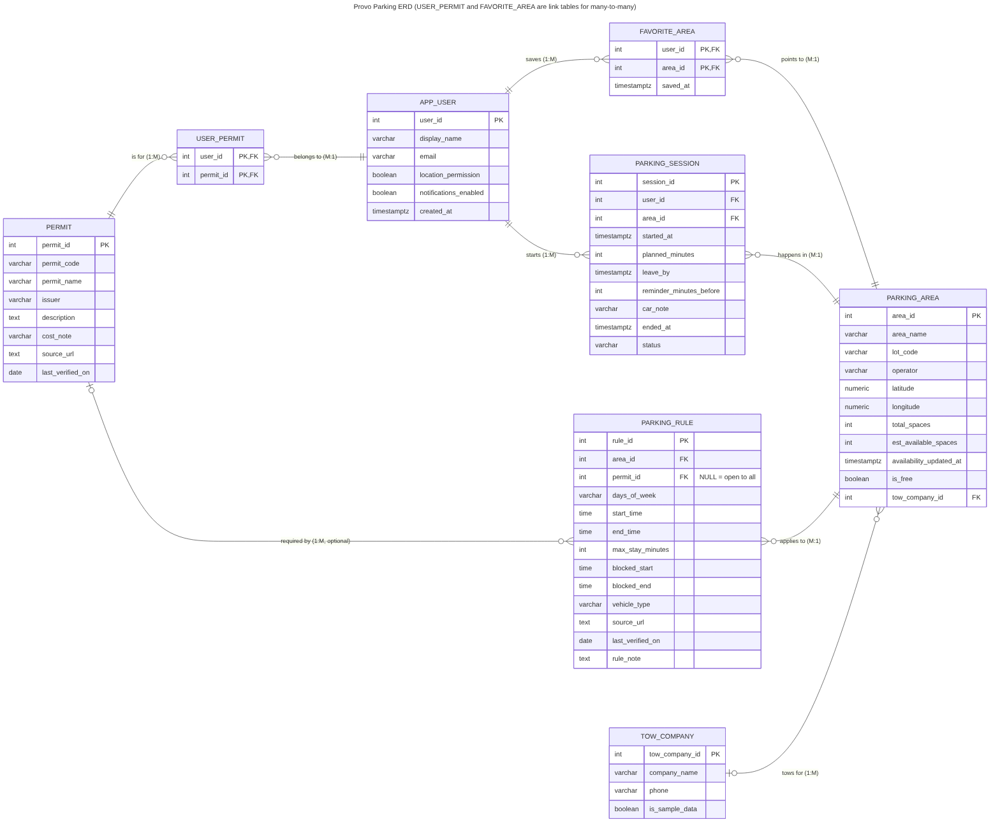
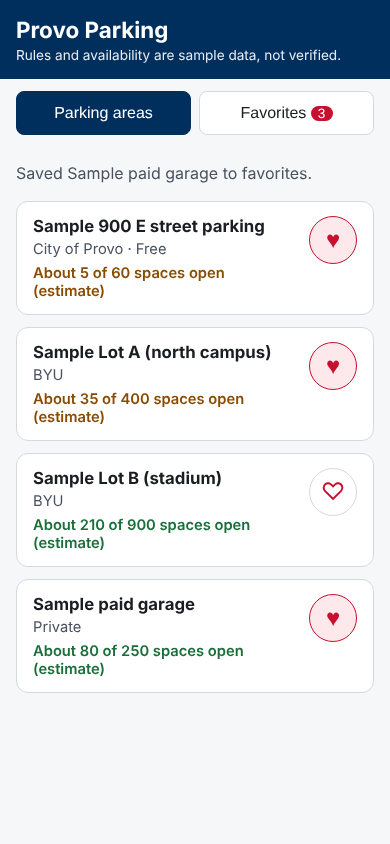

# Provo Parking

IS 401-001, Fall 2026, Team 007: Parker Morris, Liam Tanaka, Spencer Warren, James Richardson.

Live app: https://parkermorris11.github.io/ProvoParking/ (works once the Pages setup in step 3 below is done)

> Permit and parking rules are cited from BYU and Provo sources; see [docs/parking-rules-reference.md](docs/parking-rules-reference.md). Lot locations, capacities, availability, and tow details are still **sample data**.

## App Summary
Students who drive to BYU often circle lots that are full or that their permit doesn't cover, which makes them late and leads to parking tickets. Our persona, Emma Carter, is a BYU junior who commutes for 8 a.m. classes and has received three tickets this year. Provo Parking lets a driver choose their permit and planned arrival time, then shows which nearby parking areas they are allowed to use and how full each one is likely to be. Each area explains its rules in plain language, including time limits and when restrictions change. After parking, the user can start a parking timer, see where they left the car, and save favorite areas for future trips. This version implements the parking area list and the **Save to favorites** heart, which stores favorites in a real database so they survive a refresh. Eligibility is based on the permit the user selects, not on a verified BYU account.

## ERD

Source: [`docs/erd.mmd`](docs/erd.mmd) (Mermaid). Eight entities:

| Relationship | Cardinality |
|---|---|
| app_user ↔ permit, through the link table `user_permit` (one user can hold many permits; one permit type is held by many users) | many-to-many |
| app_user ↔ parking_area as favorites, through the link table `favorite_area` | many-to-many |
| app_user → parking_session | one-to-many |
| parking_area → parking_session | one-to-many |
| parking_area → parking_rule | one-to-many |
| permit → parking_rule (optional; no permit = open to all) | one-to-many |
| tow_company → parking_area | one-to-many |

## Tech Stack
| Layer | What we use |
|---|---|
| Frontend | Plain HTML, CSS, and JavaScript (`index.html`, `styles.css`, `app.js`) |
| Backend / API | Supabase auto-generated REST API, called with `supabase-js` 2.45.4 |
| Database | Supabase PostgreSQL (`supabase/schema.sql`), with Row Level Security (`supabase/policies.sql`) |
| Hosting | GitHub Pages, deployed by GitHub Actions (`.github/workflows/pages.yml`) |

**Why this fits our team:** Supabase gives us a real PostgreSQL database and an API on a free tier without anyone running or deploying a server. Everyone can see the tables in Supabase's Table Editor and all the code in GitHub. Supabase does not host web pages, so the frontend is hosted free on GitHub Pages from this same repo.

**Keys:** the Supabase URL and anon key are never committed. Locally they go in `config.js`, which is in `.gitignore`. For the live site, GitHub Actions writes `config.js` from the repository secrets `SUPABASE_URL` and `SUPABASE_ANON_KEY`. The anon key is meant to be used in a browser; Row Level Security limits it to reading parking areas and managing the demo user's favorites.

## How to Get It Running

### 1. Create the database (once per team)
1. Sign in at [supabase.com](https://supabase.com) and create a new project (free tier).
2. Open **SQL Editor**, paste all of [`supabase/schema.sql`](supabase/schema.sql), and click **Run**. This creates 8 tables with sample rows.
3. In a new query, paste [`supabase/policies.sql`](supabase/policies.sql) and click **Run**.
4. Check: **Table Editor** should list 8 tables, each with rows.
5. Go to **Project Settings > API** and copy the **Project URL** and the **anon / publishable key**.

### 2. Run it on your computer
1. Clone the repo: `git clone https://github.com/ParkerMorris11/ProvoParking.git` and `cd ProvoParking`.
2. Copy `config.example.js` to `config.js` and paste in your Project URL and anon key.
3. Start a local web server in the folder, for example `npx serve .` (Node) or `python3 -m http.server 8000`.
4. Open the address it prints (e.g. `http://localhost:8000`). You should see "4 parking areas loaded."

### 3. Live site (GitHub Pages)
1. In the GitHub repo, go to **Settings > Secrets and variables > Actions** and add two repository secrets: `SUPABASE_URL` and `SUPABASE_ANON_KEY`.
2. Go to **Settings > Pages** and set **Source** to **GitHub Actions**.
3. Push to `main` (or run the "Deploy to GitHub Pages" workflow from the **Actions** tab). The live URL appears in the workflow run.

## Verifying the Vertical Slice
The working button is the **heart (Save to favorites)** on each parking area.

1. Open the app and note the number on the **Favorites** tab (it was 2 with the original sample data; it changes as people test).
2. Tap an empty heart, for example on **Sample downtown garage**. The heart fills, the message says "Saved Sample downtown garage to favorites," and the count goes up by 1.
   - Behind the scenes, `app.js` sends an insert request to Supabase, a row is added to `favorite_area`, and Supabase returns the saved row, which the page then displays.
3. **Refresh the page.** The garage's heart is still filled and the count is unchanged.
4. Open the **Favorites** tab: the garage is listed.
5. Optional: in Supabase **Table Editor > favorite_area**, there is a new row with `user_id = 1` and the garage's `area_id`.
6. Tap the heart again to remove it; after a refresh it stays removed.

